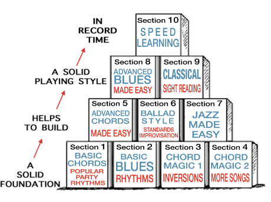

# Cursos e Progresso

Página para adicionar cursos e acompanhar o progresso feito neles, focando assim em completar um (ou as partes relevantes de um) antes de ir para o próximo. Evitando "information-overload".

> **HOW TO PRACTICE**   
> Keep one thing in mind overall - the quickest way to improve on any difficult areas is DAILY - REPETITIVE practice.  
> REPETITION IS THE KEY TO SUCCESS  

## Piano For All 

[Link pro curso na Udemy](https://www.udemy.com/course/pianoforall-incredible-new-way-to-learn-piano-keyboard/learn/lecture/30937222?start=1#overview).

The course is divided into very easy to follow sections:  
  
Sections 1 to 5 teach 'Rhythm Style' piano - the same way people learn rhythm guitar. They learn chords - then they learn how to 'strum' a rhythm and then they sing along over the top.  
From section 6 onwards you will be applying your chord and rhythm knowledge to MELODIES - Ballad style - Jazz - Blues - Improvisation and even Classical pieces. An understanding of CHORDS and RHYTHMS is ESSENTIAL for all these different genres.   Chords are the BUILDING BLOCKS of ALL music.  

- [ ] Party Time - Play-By-Ear - Rhythm Style Piano ([PDF here](arquivos-cursos/pianoforall/Section1_Complete__.pdf))

- [ ] Basic Blues & Rock ’n’ Roll

- [ ] Chord Magic & Inversions

- [ ] Advanced Chords Made Easy

- [ ] Ballad Style & Improvisation

- [ ] Jazz Piano Made Easy

- [ ] Advanced Blues, Fake Stride & The Entertainer

- [ ] Taming The Classics

- [ ] Speed Learning

## Piano Dojo

Um curso gratuíto do youtube [(link)](https://www.youtube.com/c/PianoDojo) de 42 semanas onde em cada semana se explora algo novo.  

**Pre-requisitos**
- [ ] x
- [ ] y
- [ ] z

**Escalas Maiores**

- [x] Semana 1 - 
- [ ] Semana 2 - 
